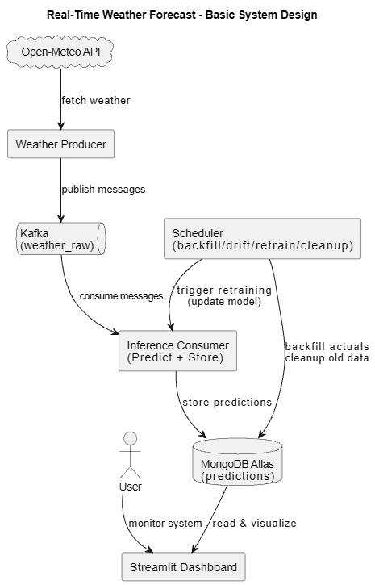

# 🌦️ Real-Time Weather Forecast (ML + Kafka + MongoDB + Streamlit)

This is a real-time weather forecasting project built using:
- **Open-Meteo API** (weather data)
- **Kafka** (streaming pipeline)
- **Machine Learning models** (prediction)
- **MongoDB Atlas** (store predictions)
- **Streamlit Dashboard** (visual monitoring)

The system continuously fetches live weather data, sends it to Kafka, runs ML inference, stores results in MongoDB, and shows everything in a dashboard.

---

##  Features
    Fetch real-time weather data (hourly)  
    Kafka producer-consumer pipeline  
    ML model prediction (temperature forecasting)  
    Stores predictions in MongoDB Atlas  
    Streamlit dashboard to visualize KPIs and predictions  
    Scheduler for:
- backfill actual temperatures
- drift monitoring
- retraining
- data retention cleanup  

---


## System Design
Below is the high-level system design for the real-time forecasting pipeline:




---
## Project Structure (Important Files)

- `docker/docker-compose.yml` → Kafka + Zookeeper setup  
- `streaming/weather_producer.py` → sends weather data to Kafka  
- `streaming/inference_consumer.py` → consumes data + predicts + stores in MongoDB  
- `ingestion/prepare_training_data.py` → prepares dataset for ML training  
- `model/compare.py` → trains and compares models  
- `orchestration/scheduler.py` → runs scheduled jobs  
- `app/Home.py` → Streamlit dashboard main page  
- `db/mongo_client.py` → MongoDB connection  

---

## Requirements
Make sure you have:
- Python 3.10+
- Docker Desktop
- MongoDB Atlas account
- Kafka running using Docker Compose

---

## Setup `.env`
Create a `.env` file in project root:

```
MONGO_URI=your_mongodb_connection_string
MONGO_DB_NAME=your_db_name
KAFKA_BOOTSTRAP_SERVERS=localhost:9092
KAFKA_TOPIC=weather_raw
```

---

## How to Run the Project (Step-by-Step)

1️⃣ Start Kafka (Docker)  
```powershell
cd docker
docker compose up -d
# then verify
docker ps
```

2️⃣ Prepare Training Data (5-year dataset)  
```powershell
python ingestion/prepare_training_data.py
```
This will generate:
- `data/processed/weather_5y_raw.csv`
- `data/processed/supervised_weather.csv`

3️⃣ Train + Select Best Model  
```powershell
python model/compare.py
```
This will save the best model in `model/artifacts/`

4️⃣ Start Weather Producer (Kafka)  
```powershell
python streaming/weather_producer.py
```

5️⃣ Start Inference Consumer (Prediction + MongoDB)  
```powershell
python streaming/inference_consumer.py
```
This will:
- consume weather messages
- predict next temperature
- store results in MongoDB

6️⃣ Start Streamlit Dashboard  
```powershell
streamlit run app/Home.py
```
Dashboard will open at: `http://localhost:8501`

7️⃣ Run Scheduler (Optional)  
```powershell
python orchestration/scheduler.py
```
This will automatically run:
- backfill actuals
- drift check
- retraining
- retention cleanup

---

## Output (predictions collection)
Each document stores:
- `timestamp`
- `prediction`
- `actual_temperature` (filled later by backfill)
- `model_name`
- `created_at`

---

## Notes
- Actual temperatures will not be available immediately.
- Backfilling works only when Open-Meteo archive has the actual value available.
- All timestamps in the project use IST (Asia/Kolkata +05:30).

---

## Troubleshooting
### No predictions appearing?
- Ensure `weather_producer.py` is running.
- Ensure `inference_consumer.py` is running.
- Verify Kafka broker is running on `localhost:9092`.

### Backfill not working?
- Wait 1+ hour after predictions are created.
- Check the scheduler is running.
- Verify MongoDB has predictions with `actual_temperature: null`.

### Timezone issues?
- Project uses IST; ensure modules correctly handle offset-aware datetimes.

---

## Quick Start (one-line)
```powershell
# Start docker (kafka) -> prepare data -> train -> run pipeline -> dashboard
cd docker && docker compose up -d
python ingestion/prepare_training_data.py
python model/compare.py
start cmd /k "python streaming/weather_producer.py"
start cmd /k "python streaming/inference_consumer.py"
start cmd /k "python orchestration/scheduler.py"
start cmd /k "streamlit run app/Home.py"
```

---

## 📚 Files Structure (summary)
```
e:\CODES\Real Time weather Forecast\
├── streaming/
│   ├── weather_producer.py
│   └── inference_consumer.py
├── orchestration/
│   ├── scheduler.py
│   ├── backfill_actuals.py
│   └── drift_monitor.py
├── model/
│   └── artifacts/
├── ingestion/
│   └── prepare_training_data.py
├── app/
│   ├── Home.py
│   └── Pages/
├── db/
│   └── mongo_client.py
└── data/
```

---

## Author
Made by Khushal 🚀

